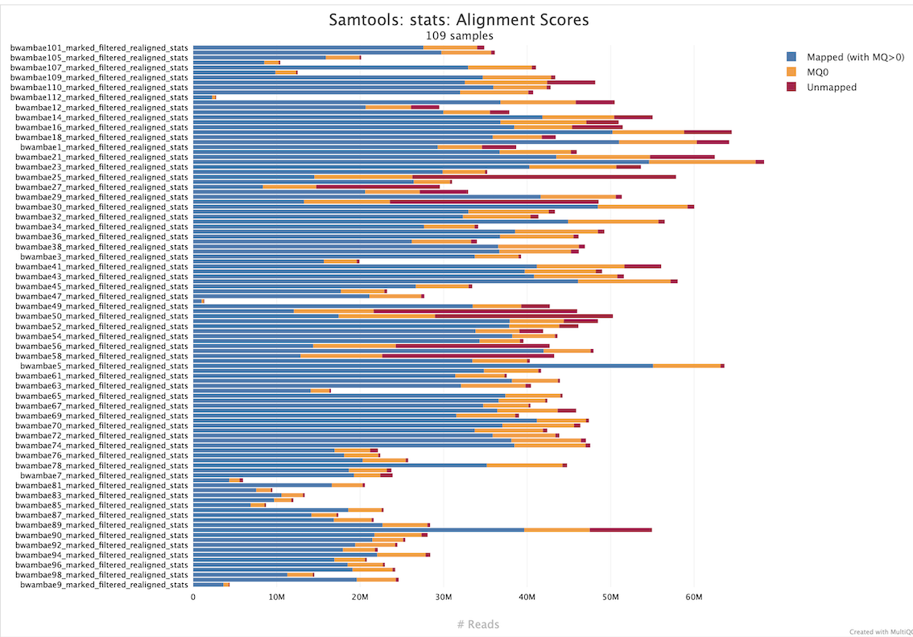

# Mapping Reads to a Reference Genome with BWA: Burrows-Wheeler Aligner

<h2 class="no-toc">Table of Content</h2>

[TOC]

## Overview

**BWA (Burrows-Wheeler Aligner)** is a fast and memory-efficient software package for aligning relatively short nucleotide sequences (*reads*) against a large reference genome, such as the human genome. It is widely used in bioinformatics pipelines for processing next-generation sequencing (NGS) data.

BWA supports three primary algorithms:

- **BWA-backtrack**: Optimized for short reads (≤100 bp), typically from early Illumina platforms.
- **BWA-SW**: Suitable for longer reads with higher error rates.
- **BWA-MEM**: The most commonly used algorithm, designed for reads ≥70 bp. It is accurate, fast, and supports gapped alignment and split-read mapping.

## Scientific Principles

BWA is based on the **Burrows-Wheeler Transform (BWT)** and the **FM-index**, which enable efficient substring matching in large texts. The BWT rearranges a string into runs of similar characters, facilitating compression and fast search. The FM-index, a compressed suffix array, allows backward searching of patterns in logarithmic time.

The alignment process involves:

1. **Indexing** the reference genome using BWT and FM-index.
2. **Seeding**: Finding exact or near-exact matches of substrings (seeds) from the query.
3. **Extension**: Extending seeds into full alignments using dynamic programming.
4. **Scoring**: Assigning alignment scores based on match/mismatch, gap penalties, and quality scores.

## Typical Usage

### Indexing the Reference Genome

Before alignment, the reference genome must be indexed:

```bash
bwa index reference.fasta
```

This generates several auxiliary files (`.amb`, `.ann`, `.bwt`, `.pac`, `.sa`) used during alignment.

### Preparing a List of Fastq Files To Be Treated


```bash title="generate_fastq_files_list.sh" linenums="1"
#!/bin/bash

ls -1 raw | grep -E '_1\.fastq\.gz' | sed 's/_\(1\)\.fastq\.gz//g' > info_files/fastq_files.list
```
This script scans the raw/ directory for paired-end FASTQ files with names ending in _1.fastq.gz.
It extracts the sample names (removing the _1.fastq.gz suffix) and writes one sample name per line to the file info_files/fastq_files.list.


### Mapping Reads On a Reference Genome with BWA-MEM on a HPC Cluster

#### Samples in a unique pair of Fastq files
Here is a script used for the mapping of paired-end Fastq files from the mosquito *Anopheles gambiae*. Each sample is in a unique pair of Fastq files (`<samplename>_1|R1.fastq.gz; <samplename>_2|R2.fastq.gz`):

```bash linenums="1"
#!/bin/bash
###################configuration slurm##############################
#SBATCH -A invalbo
#SBATCH --job-name=bwa
#SBATCH --time=04:00:00
#SBATCH -p fast
#SBATCH -N 1
#SBATCH -n 1
#SBATCH --cpus-per-task 16
#SBATCH --mem=16G
#SBATCH --array 1-8
#SBATCH -o Cluster_logs/%x-%j-%N.out
#SBATCH -e Cluster_logs/%x-%j-%N.err
#SBATCH --mail-user=loic.talignani@ird.fr
#SBATCH --mail-type=FAIL
####################################################################

start_time=$(date +%s)

# Recover of fastq file name
SAMPLENAME=$(sed -n "${SLURM_ARRAY_TASK_ID}p" info_files/fastq_names)
echo ${SAMPLENAME}

# Create ReadGroup for bwa
READGROUP="@RG\tID:${SAMPLENAME}\tSM:${SAMPLENAME}\tCN:SC\tPL:ILLUMINA"
echo ${READGROUP}

REFPATH="resources/genomes"
TRIMMINGPATH="results/01_Trimming"
OUTPUTPATH="results/02_Mapping"
mkdir -p ${OUTPUTPATH}
REPORTPATH="results/11_Reports/bwa"
mkdir -p ${REPORTPATH}


module load bwa/0.7.17

# bwa OPTIONS:
# -t <INT>: threads
# -M: Mark shorter split hits as secondary (for Picard compatibility)
# -T <INT>: Don’t output alignment with score lower than INT. This option only affects output. [default: 30]
# -v <INT>: Control the verbose level of the stderr: 0 - disable all, 1 - output errors only
#           2 - output warning and errors, 3 - all normal messages.

bwa mem -M -T 0 -t 16 \
  -R ${READGROUP} \
  ${REFPATH}/Anopheles-gambiae-PEST_CHROMOSOMES_AgamP4.fa\
  ${TRIMMINGPATH}/${SAMPLENAME}_trimmomatic_R1.fastq.gz\
  ${TRIMMINGPATH}/${SAMPLENAME}_trimmomatic_R2.fastq.gz > ${OUTPUTPATH}/${SAMPLENAME}.sam \
  2> ${REPORTPATH}/${SAMPLENAME}-bwa.err

end_time=$(date +%s)  # Capture l'heure de fin
duration=$((end_time - start_time))  # Calcule la durée
echo "The script completed successfully in $((duration / 60)) minutes and $((duration % 60)) seconds."
```

This SLURM batch script is designed to perform parallelized read alignment using BWA-MEM on a high-performance computing (HPC) cluster. It leverages SLURM's job array functionality to process multiple samples in parallel, each defined by a line in a file named fastq_names.

##### SLURM Configuration

```bash linenums="11"
#SBATCH --array 1-8
```
This line tells SLURM to run the script as an array job with 8 tasks. Each task will process a different sample, determined by its line number in the info_files/fastq_names file.

Other key SLURM directives:
```bash linenums="1"
--cpus-per-task=16: Allocates 16 CPU threads per task.
--mem=16G: Allocates 16 GB of RAM.
--time=04:00:00: Sets a 4-hour time limit.
--mail-type=FAIL: Sends an email if the job fails.
```

##### Sample Name and Read Group
The script extracts the sample name corresponding to the current array task:
```bash linenums="21"
SAMPLENAME=$(sed -n "${SLURM_ARRAY_TASK_ID}p" info_files/fastq_names)
```
It then constructs a Read Group (RG) string, which is essential for downstream tools like GATK:
```bash 
READGROUP="@RG\\tID:${SAMPLENAME}\\tSM:${SAMPLENAME}\\tCN:SC\\tPL:ILLUMINA"
```

##### BWA-MEM Alignment
The core of the script is the bwa mem command:
```bash linenums="25"
bwa mem -M -T 0 -t 16 \\
  -R ${READGROUP} \\
  ${REFPATH}/Anopheles-gambiae-PEST_CHROMOSOMES_AgamP4.fa \\
  ${TRIMMINGPATH}/${SAMPLENAME}_trimmomatic_R1.fastq.gz \\
  ${TRIMMINGPATH}/${SAMPLENAME}_trimmomatic_R2.fastq.gz \\
  > ${OUTPUTPATH}/${SAMPLENAME}.sam \\
  2> ${REPORTPATH}/${SAMPLENAME}-bwa.err
```

##### Key Options Explained
- **-M**: Marks shorter split hits as secondary. This is important for compatibility with Picard tools, which expect this flag for proper duplicate marking.  
- **-T 0**: Disables the minimum alignment score threshold. By default, BWA filters out alignments with a score below 30. Setting -T 0 ensures that all alignments, even low-quality ones, are retained in the output SAM file. Reads with low quality will be marked as "MQ0" by samtools (see figure below).  
This is particularly useful when using samtools stats after duplicate removal, as it allows reads with mapping quality 0 (MQ0) to be included in the statistics. These reads are often excluded by default but can be informative for assessing alignment quality and coverage.  
- **-t 16**: Uses 16 threads to speed up the alignment process.  


*Example of MQ0 reads (in orange) in samtools stats when -T option is set to 0*

#### Samples in multiple lanes = multiple Fastq files

Sometimes, a single biological sample is sequenced across multiple lanes of a *Illumina flowcell*. This is done for a few reasons:  
- To increase sequencing depth (more data = better coverage)  
- To balance the load across lanes  
- To reduce technical biases from a single lane  

As a result, you may receive multiple FASTQ files for the same sample, one from each lane.
These files usually have lane identifiers in their filenames (e.g., Sample1_`L001`_R1.fastq.gz, Sample1_`L002`_R1.fastq.gz, etc.).

!!! note "It is important to preserve the lane information when mapping reads."
    Each group of reads from a lane must be mapped separately using a specific Read Group (RG) tag in the aligner (e.g., with @RG in bwa mem), which includes the lane number. This allows downstream tools to track the origin of each read and correct for lane-specific technical variations.

In this case,the content of the info_files/fastq_files.list will be:

```bash title="info_files/fastq_files.list" linenums="1"
Sample_1_EKDN230051723-1A_H2F5FDSXC_L3
Sample_1_EKDN230051723-1A_H2WC5DSXC_L2
Sample_2_EKDN230051724-1A_HFTFWDSX7_L4
Sample_3_EKDN230051725-1A_H2WC5DSXC_L2
Sample_3_EKDN230051725-1A_HFTFWDSX7_L4
```
Sample_1 has two lanes (L2/L3), Sample_3 has two lanes (L2/L4) ans Sample_2 has only one lane.

Here is a script used for the mapping of paired-end Fastq files from the mosquito *Anopheles gambiae*, in multiple pair (or not) of Fastq files:

```bash title="BWA mapping script - multiple lanes case" linenums="1"
#!/bin/bash
###################configuration slurm##############################
#SBATCH -A invalbo
#SBATCH --time=2-23:00:00
#SBATCH --job-name=bwa
#SBATCH -p long
#SBATCH -N 1
#SBATCH -n 1
#SBATCH --cpus-per-task 16
#SBATCH --mem=32G
#SBATCH --array 11-22
#SBATCH -o Cluster_logs/%x-%j-%N.out
#SBATCH -e Cluster_logs/%x-%j-%N.err
#SBATCH --mail-user=loic.talignani@ird.fr
#SBATCH --mail-type=FAIL
####################################################################

# Recover of fastq file name
SAMPLELANE=$(sed -n "${SLURM_ARRAY_TASK_ID}p" info_files/fastq_files)
echo ${SAMPLELANE}

# Extract Sample name
SAMPLE=$(echo ${SAMPLELANE} | awk -F'[_]' '{print $1"_"$2}')
echo ${SAMPLE}

# Extract Lane number
LANE=$(echo ${SAMPLELANE} | awk -F'[_]' '{print $5}')
echo ${LANE}

# Create ReadGroup for bwa
READGROUP="@RG\tID:${LANE}\tSM:${SAMPLE}\tCN:SC\tPL:ILLUMINA"
echo ${READGROUP}

module load bwa/0.7.17 samtools/1.15.1

# bwa OPTIONS:
# -t <INT>: threads
# -M: Mark shorter split hits as secondary (for Picard compatibility)
# -T <INT>: Don’t output alignment with score lower than INT. This option only affects output. [default: 30]
# -v <INT>: Control the verbose level of the stderr: 0 - disable all, 1 - output errors only
#           2 - output warning and errors, 3 - all normal messages.

bwa mem -M -t 16 \
  -R ${READGROUP} \
  resources/genomes/GCF_035046485.1_AalbF5_genomic.fna \
  results/01_Trimming/${SAMPLELANE}_trimmomatic_R1.fastq.gz \
  results/01_Trimming/${SAMPLELANE}_trimmomatic_R2.fastq.gz > \
  results/02_Mapping/${SAMPLELANE}.sam \
  2> results/11_Reports/bwa/${SAMPLELANE}-bwa.err
```
</br>

##### The pattern
The FASTQ filenames in info_files/fastq_files list follow this pattern:
```bash
Sample_1_EKDN230051723-1A_H2F5FDSXC_L3
```
Structure (underscore-delimited):
```bash
$1        $2       $3              $4        $5
Sample    1   EKDN230051723-1A   H2F5FDSXC   L3
```
</br>

1. Extracting the Sample Name
   
```bash linenums="23"
SAMPLE=$(echo ${SAMPLELANE} | awk -F'[_]' '{print $1"_"$2}')
```

- `-F'[_]'`: Sets the field separator to _ (underscore).  
- `{print $1"_"$2}`: Concatenates the first and second fields (e.g., Sample_1).  
**Purpose**: This extracts just the biological sample name, discarding sequencing run or lane info.

</br>
2. Extracting the Lane Number
```bash linenums="27"
LANE=$(echo ${SAMPLELANE} | awk -F'[_]' '{print $5}')
```
Uses the same field splitting.  
- `{print $5}`: Returns the fifth field, which is the lane ID, e.g., L3.  
**Purpose**: Extracts the lane identifier to uniquely label the read group by sequencing origin.

**These extracted values are used to construct the @RG (Read Group) line passed to BWA:**
```bash linenums="31,44"
READGROUP="@RG\tID:${LANE}\tSM:${SAMPLE}\tCN:SC\tPL:ILLUMINA"
```

- `ID`: the lane (e.g., L3)  
- `SM`: the sample (e.g., Sample_1)  
- `CN`: center name (hardcoded here as SC)  
- `PL`: platform (ILLUMINA)  

This enables tools like `GATK`, used in downstream analysis, to distinguish reads by lane and sample, correct for batch effects, and handle duplicates correctly. 

Only after alignment, once the Read Groups are set, the resulting BAM files can be merged into a single file. This ensures that each read retains its correct sequencing context. See The Bam File section for more informations.

So, although the sample appears split at the FASTQ level, it is best to map each lane separately and merge the BAMs later — not the FASTQs — to preserve data integrity and support proper downstream processing like duplicate marking or base recalibration.