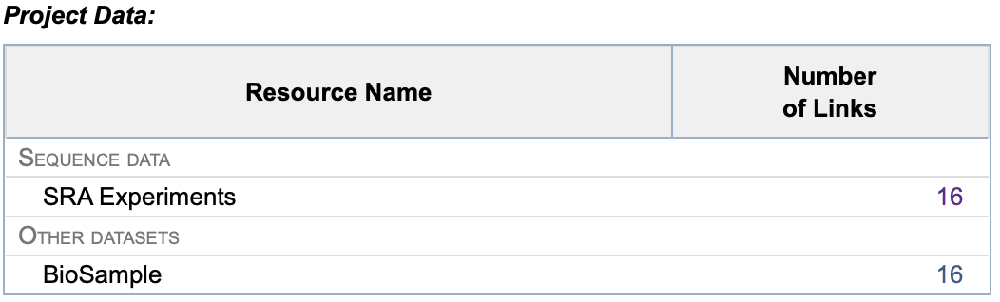

# Renaming FASTQ Files Downloaded from the *Short Read Archive* (SRA)

<h2 class="no-toc">Table of Content</h2>

[TOC]

## Introduction to the Short Read Archive (SRA)

The **Short Read Archive (SRA)** is a public repository maintained by the **National Center for Biotechnology Information** (NCBI). It is a valuable resource for researchers who wish to access and reuse sequencing datasets for comparative studies, benchmarking, or meta-analyses.  
  
SRA organizes sequencing data hierarchically into **BioProjects**, **BioSamples**, and **Runs**. A BioProject represents a broader research initiative, while each BioSample corresponds to a specific biological specimen. Under each BioSample, one or more Runs contain the actual sequencing data, typically in FASTQ format. However, the FASTQ files downloaded from SRA are named using the Run accession (e.g., SRR12345678) or sometimes the BioSample ID, which often does not reflect the actual biological or experimental sample name used in the study. This mismatch can make downstream analysis and interpretation difficult.  

Fortunately, a **CSV file** is usually provided alongside the dataset, mapping each Run or BioSample to its corresponding Sample Name—a more meaningful and human-readable identifier. This allows users to rename the FASTQ files accordingly, improving clarity and traceability in data processing pipelines.

## Downloading FASTQ Files Using `sra-tools`

### Download one Fastq File
To retrieve sequencing data from SRA, the `sra-tools` suite is commonly used. One of its key utilities is `fasterq-dump`, which efficiently converts SRA accessions into FASTQ files.

Here is an example command to download paired-end reads:

```bash
prefetch SRR12345678
fasterq-dump SRR12345678 --split-files --gzip
```
!!! tip "You don’t have to use prefetch before fasterq-dump but:" 
    -  Using prefetch is more stable for large downloads or on clusters. 
    -  It Allows you to download .sra files in advance and convert them later. 
    -  The conversion is faster and the recovery is easier if something goes wrong.

This command downloads and compresses the paired-end reads into two files:  
- `SRR12345678_1.fastq.gz`  
- `SRR12345678_2.fastq.gz`  


### Download an entire BioProject
**SRA Accession List**  
This list helps you downloding a batch of Fastq Files:  
1. Go the [NCBI Short Read Archive web site](https://www.ncbi.nlm.nih.gov/sra/).  
2. Check for a BioProject (ie: PRJNA484104). As a result, there is a list of BioSamples. Just click on the first results and select the BioPreject value in `Study` item.  
3. Click on "`send to:`" on the right corner and select "`Choose Destination`" -> `File`, "`Format`" -> `Accession List`. Then click on the "`Create File`" button.  
4. Move the `SraAccList.csv` list in the project directory, where you want to store the Fastq files.  

**RunInfo Table**  
5. From the Bioproject page, click on the Number of Links of **SRA Experiments** tab (in the Project Data summary table).  
  
6. On the SRA page, click on the `Send to:` on the right corner.  
7. Select `File` and choose `RunInfo`, then click `Create File`.
8. Move the `SRA_Run_Table.txt` list in the project directory, where you want to store the Fastq files. 

### Download Runs
1. Use prefetch command to download the Runs:
```bash linenums="1"
prefetch --max-size 100G --option-file SraAccList.csv
```
2. The download is starting.

### Unzip SRA Data
```bash linenums="1"
for file in $(cat SraAccList.csv); do fasterq-dump --split-files $file done
```

### Renaming FASTQ Files Based on a CSV File

After downloading, it is often useful to rename the FASTQ files using meaningful sample names. The following Bash script automates this process using the .csv file present in the Bioproject that maps SRA run accessions to sample names:

```bash
#!/bin/bash

# Prompt for the CSV file name
read -p "Please enter the name and the path of the CSV file: " csv_file

# Check if the CSV file exists
if [ ! -f "$csv_file" ]; then
    echo "The file $csv_file does not exist."
    exit 1
fi

# Read the CSV and rename files
while IFS=';' read -r Run SampleName _
do
    if [ -f "${Run}_1.fastq.gz" ]; then
        new_filename="${SampleName}_1.fastq.gz"
        mv "${Run}_1.fastq.gz" "$new_filename"
        echo "File ${Run}_1.fastq.gz renamed in $new_filename"
    elif [ -f "${Run}_2.fastq.gz" ]; then
        new_filename="${SampleName}_2.fastq.gz"
        mv "${Run}_2.fastq.gz" "$new_filename"
        echo "File ${Run}_2.fastq.gz renamed in $new_filename"
    else
        echo "The file ${Run}_1.fastq.gz or ${Run}_2.fastq.gz dos not exist."
    fi
done < "$csv_file"
```

### Step-by-Step Explanation

1. **Prompt for CSV Input**: The script asks the user to enter the name of a CSV file containing SRA run IDs and sample names.

2. **File Existence Check**: It verifies that the specified CSV file exists before proceeding.

3. **CSV Parsing**: The script reads the CSV line by line, assuming fields are separated by semicolons (`;`). It extracts the SRA run ID (`Run`) and the corresponding sample name (`SampleName`).

4. **File Renaming**:
   - If a file named `${Run}_1.fastq.gz` exists, it is renamed to `${SampleName}_1.fastq.gz`.
   - If a file named `${Run}_2.fastq.gz` exists, it is renamed to `${SampleName}_2.fastq.gz`.
   - If neither file exists, a warning message is printed.

This script is particularly useful when working with large datasets where manual renaming would be time-consuming and error-prone.


## Downloading FASTQ Files Using `sra-tools` on a HPC Cluster

### Download an entire BioProject
**SRA Accession List**  
This list helps you downloding a batch of Fastq Files:  
1. Go the [NCBI Short Read Archive web site](https://www.ncbi.nlm.nih.gov/sra/).  
2. Check for a BioProject (ie: PRJNA484104). As a result, there is a list of BioSamples. Just click on the first results and select the BioPreject value in `Study` item.  
3. Click on "`send to:`" on the right corner and select "`Choose Destination`" -> `File`, "`Format`" -> `Accession List`. Then click on the "`Create File`" button.  
4. Upload the `SraAccList.csv` list in the project directory, where you want to store the Fastq files.  

**RunInfo Table**  
5. From the Bioproject page, click on the Number of Links of **SRA Experiments** tab (in the summary table).  
  
6. On the SRA page, click on the `Send to:` on the right corner.  
7. Select `File` and choose `RunInfo`, then click `Create File`.
8. Upload the `SRA_Run_Table.txt` list in the project directory, where you want to store the Fastq files. 

### Batch Data Transfer
1. On the HPC cluster, go the the raw data directory of the project directory.
2. Load the sra-tools module and enter in the configuration mode: 
```bash linenums="1"
module load sra-tools/3.1.1
vdb-config --interactive
```
3. On the `Tools` tab, select `prefetch downloads to * current directory`.
4. Choose "`s`" to save and "`x`" to exit config.

### Download Runs
1. Use prefetch command to download the Runs:
```bash linenums="1"
prefetch --max-size 100G --option-file SraAccList.csv
```
2. The download is starting.

### Unzip SRA Data
```bash linenums="1"
for file in $(cat SraAccList.csv); do fasterq-dump --split-files $file done
```

### Rename Fastq Files
Use the `SRA_Run_Table.txt` and the following script to rename automatically the Fastq files:

```bash
#!/bin/bash

# Prompt for the CSV file name
read -p "Please enter the name and the path of the CSV file: " csv_file

# Check if the CSV file exists
if [ ! -f "$csv_file" ]; then
    echo "The file $csv_file does not exist."
    exit 1
fi

# Read the CSV and rename files
while IFS=';' read -r Run SampleName _
do
    if [ -f "${Run}_1.fastq.gz" ]; then
        new_filename="${SampleName}_1.fastq.gz"
        mv "${Run}_1.fastq.gz" "$new_filename"
        echo "File ${Run}_1.fastq.gz renamed in $new_filename"
    elif [ -f "${Run}_2.fastq.gz" ]; then
        new_filename="${SampleName}_2.fastq.gz"
        mv "${Run}_2.fastq.gz" "$new_filename"
        echo "File ${Run}_2.fastq.gz renamed in $new_filename"
    else
        echo "The file ${Run}_1.fastq.gz or ${Run}_2.fastq.gz dos not exist."
    fi
done < "$csv_file"
```

