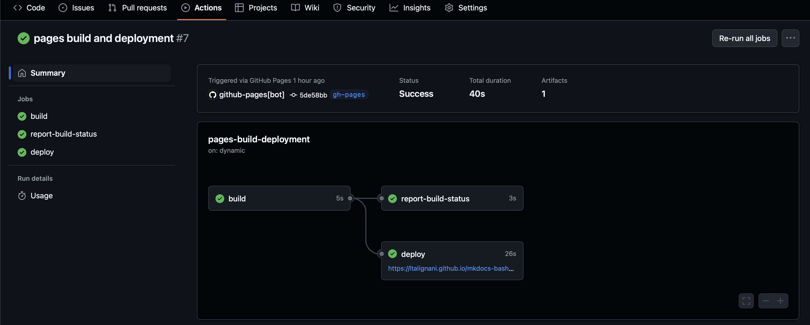
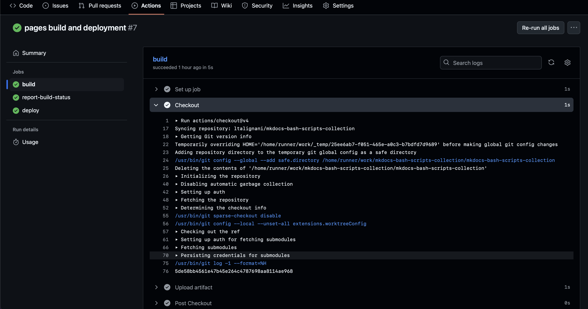

# Continuous Integration/Continuous Deployment (CI/CD)

<h2 class="no-toc">Table of Content</h2>

[TOC]

## What is CI/CD?

**Continuous Integration (CI)** is the practice of automatically testing code changes when they're pushed to a repository.

**Continuous Deployment (CD)** is the practice of automatically deploying code changes to production after they pass all tests.

## CI/CD Pipeline Stages

```
Code Push → Build → Test → Deploy → Monitor
     ↓         ↓      ↓       ↓        ↓
  GitHub   Compile  Unit   Production  Logs
  GitLab   Install  Tests  Staging     Metrics
  Bitbucket        Integration         Alerts
```

## GitHub Actions (CI/CD Example)

GitHub Actions is GitHub's built-in CI/CD platform.

### Basic GitHub Actions Workflow

Create `.github/workflows/ci.yml`:

```yaml
name: CI/CD Pipeline

# Trigger on push and pull requests to main
on:
  push:
    branches: [ main ]
  pull_request:
    branches: [ main ]

jobs:
  test:
    runs-on: ubuntu-latest
    
    steps:
    # Checkout code
    - uses: actions/checkout@v3
    
    # Setup Node.js
    - name: Setup Node.js
      uses: actions/setup-node@v3
      with:
        node-version: '18'
    
    # Install dependencies
    - name: Install dependencies
      run: npm install
    
    # Run tests
    - name: Run tests
      run: npm test
    
    # Run linting
    - name: Run linter
      run: npm run lint

  deploy:
    needs: test
    runs-on: ubuntu-latest
    if: github.ref == 'refs/heads/main'
    
    steps:
    - uses: actions/checkout@v3
    
    - name: Deploy to production
      run: |
        echo "Deploying to production..."
        # Add your deployment commands here
```

### Python Project Example

`.github/workflows/python-ci.yml`:

```yaml
name: Python CI

on: [push, pull_request]

jobs:
  test:
    runs-on: ubuntu-latest
    strategy:
      matrix:
        python-version: [3.8, 3.9, 3.10]
    
    steps:
    - uses: actions/checkout@v3
    
    - name: Set up Python ${{ matrix.python-version }}
      uses: actions/setup-python@v4
      with:
        python-version: ${{ matrix.python-version }}
    
    - name: Install dependencies
      run: |
        python -m pip install --upgrade pip
        pip install pytest
        pip install -r requirements.txt
    
    - name: Run tests
      run: pytest tests/
    
    - name: Run coverage
      run: |
        pip install coverage
        coverage run -m pytest
        coverage report
```

The trigger block defines the conditions under which the action will be executed. The job block specifies additional details, including the operating system on which the action should run (runs-on) and the sequence of tasks to be performed (steps).

You don’t need to write your .yaml file from scratch — numerous examples are available on GitHub. You can simply adapt one to match your specific workflow requirements.

Once your .yaml file is ready and the action has been triggered (for example, by pushing a commit), you can access the logs to monitor the execution. Below is an example using a test-coverage action.

1. Go to the Github corresponding repository. In the Àctions`tab, select one of the workflows to display its successive runs.


You can view the commits where the workflow was executed, along with details such as the branch, date, duration, and other relevant information. A green check mark indicates that the workflow completed successfully without errors, while a red cross signifies that the workflow failed.

2. From there, select the run you’re interested in to access a summary of the workflow execution. If there are any warnings, they will appear in the Annotations panel at the bottom of the screen.
To view detailed logs, click on the workflow name either in the central panel or in the Jobs section on the left. Each step can be expanded to display its corresponding output logs.
   



## GitLab CI/CD Example

GitLab uses `.gitlab-ci.yml` for CI/CD configuration:

```yaml
stages:
  - build
  - test
  - deploy

variables:
  NODE_VERSION: "18"

build:
  stage: build
  image: node:$NODE_VERSION
  script:
    - npm install
    - npm run build
  artifacts:
    paths:
      - dist/

test:
  stage: test
  image: node:$NODE_VERSION
  script:
    - npm install
    - npm test
    - npm run lint
  coverage: '/Lines\s*:\s*(\d+\.\d+)%/'

deploy:
  stage: deploy
  image: node:$NODE_VERSION
  script:
    - npm install
    - npm run deploy
  only:
    - main
```

## CI/CD Best Practices

### 1. Fail Fast
```yaml
# Run fastest tests first
jobs:
  lint:
    runs-on: ubuntu-latest
    steps:
      - uses: actions/checkout@v3
      - name: Run linter
        run: npm run lint
  
  test:
    needs: lint  # Only run tests if linting passes
    runs-on: ubuntu-latest
    steps:
      - name: Run tests
        run: npm test
```

### 2. Use Build Matrices
```yaml
strategy:
  matrix:
    os: [ubuntu-latest, windows-latest, macos-latest]
    node-version: [16, 18, 20]
```

### 3. Cache Dependencies
```yaml
- name: Cache node modules
  uses: actions/cache@v3
  with:
    path: ~/.npm
    key: ${{ runner.os }}-node-${{ hashFiles('**/package-lock.json') }}
```

### 4. Secure Secrets
```yaml
- name: Deploy
  env:
    API_KEY: ${{ secrets.API_KEY }}
    DATABASE_URL: ${{ secrets.DATABASE_URL }}
  run: deploy.sh
```

## Branch Protection Rules

Enforce quality through branch protection:

```bash
# GitHub settings example (done via web interface):
# - Require pull request reviews before merging
# - Require status checks to pass before merging
# - Require branches to be up to date before merging
# - Require linear history
```

## Practical Integration Examples

### Example 1: Feature Development with CI/CD

```bash
# 1. Start feature branch
git checkout -b feature/user-dashboard
git push -u origin feature/user-dashboard

# 2. Make changes
echo "Dashboard component" > dashboard.js
git add dashboard.js
git commit -m "Add user dashboard component"

# 3. Push triggers CI
git push origin feature/user-dashboard
# CI runs: lint, test, build

# 4. Create Pull Request
# CI runs again on PR

# 5. After review and CI passes, merge
# CD automatically deploys to staging

# 6. After testing, merge to main
# CD automatically deploys to production
```

### Example 2: Hotfix with Fast Deployment

```bash
# 1. Create hotfix branch
git checkout main
git pull origin main
git checkout -b hotfix/critical-security-fix

# 2. Fix the issue
echo "Security patch" > security.patch
git add security.patch
git commit -m "Fix critical security vulnerability"

# 3. Push and create PR
git push origin hotfix/critical-security-fix
# Fast-track CI/CD pipeline for hotfixes

# 4. Emergency deployment
# Skip normal review process if critical
# Deploy directly to production after CI passes
```

### Example 3: Release Management

```bash
# 1. Create release branch
git checkout develop
git checkout -b release/v2.0.0

# 2. Prepare release
echo "2.0.0" > VERSION
git add VERSION
git commit -m "Bump version to 2.0.0"

# 3. Push release branch
git push origin release/v2.0.0
# CI runs full test suite

# 4. Merge to main
git checkout main
git merge release/v2.0.0
git tag v2.0.0
git push origin main --tags

# 5. CD deploys tagged release to production
```

## Integration with Development Tools

### IDE Integration

Most modern IDEs support Git and CI/CD:

**VS Code Extensions:**
- GitLens
- GitHub Pull Requests
- GitLab Workflow

**Commands in VS Code:**
```bash
# Git integration is built-in
# Use Command Palette (Ctrl+Shift+P):
# - Git: Clone
# - Git: Commit
# - Git: Push
# - Git: Pull Request
```

### Code Quality Tools

#### Pre-commit Hooks

Install pre-commit hooks to run checks before commits:

```bash
# Install pre-commit
pip install pre-commit

# Create .pre-commit-config.yaml
cat > .pre-commit-config.yaml << EOF
repos:
  - repo: https://github.com/psf/black
    rev: 22.3.0
    hooks:
      - id: black
  - repo: https://github.com/pycqa/flake8
    rev: 4.0.1
    hooks:
      - id: flake8
EOF

# Install hooks
pre-commit install
```

#### Code Coverage

Track code coverage in CI:

```yaml
# In GitHub Actions
- name: Run tests with coverage
  run: |
    pip install coverage
    coverage run -m pytest
    coverage report --fail-under=80
```

## Troubleshooting Advanced Git Issues

### Recovering from Rebase Disasters

```bash
# Find your commits in reflog
git reflog

# Reset to before rebase
git reset --hard HEAD@{5}

# Or use rebase abort if still in progress
git rebase --abort
```

### Handling Large Repositories

```bash
# Shallow clone (faster for CI)
git clone --depth 1 https://github.com/user/repo.git

# Partial clone (Git 2.19+)
git clone --filter=blob:none https://github.com/user/repo.git
```

### Fixing Merge Conflicts in CI

```yaml
# In CI configuration
- name: Auto-merge main
  run: |
    git config user.name "CI Bot"
    git config user.email "ci@example.com"
    git fetch origin main
    git merge origin/main || (echo "Merge conflict detected" && exit 1)
```

## CI/CD Best Practices

1. **Fail fast** with quick feedback
2. **Test in production-like environments**
3. **Use feature flags** for safer deployments
4. **Monitor deployments** with rollback capabilities
5. **Automate security scanning**

## Conclusion

CI/CD practices are essential for professional software development. CI/CD automates the process of testing and deploying code, reducing errors and increasing development velocity. By combining these practices with proper branch protection and code review processes, you create a robust development environment that scales with your team and project complexity.

Remember: start simple and gradually introduce more advanced practices as your team and project grow. The key is consistency and automation to reduce manual errors and improve code quality.